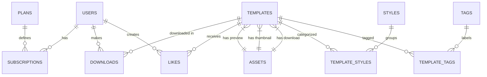

<p align="center">
  
</p>

<h1 align="center">SceneYard</h1>

<p align="center">
  <strong>A premium credit-based marketplace for After Effects templates</strong>
</p>

<p align="center">
  <a href="#-tech-stack"></a>
  <a href="#-tech-stack"></a>
  <a href="#-tech-stack"></a>
  <a href="#-tech-stack"></a>
</p>

<p align="center">
  <a href="#-features">Features</a> •
  <a href="#-architecture">Architecture</a> •
  <a href="#-database-design">Database</a> •
  <a href="#-getting-started">Getting Started</a> •
  <a href="#-project-structure">Project Structure</a>
</p>

---

## 📖 Overview

SceneYard is a modern, full-stack SaaS platform designed for motion designers and video editors. It provides a curated library of professional After Effects templates through a subscription-based credit system.

**Key Highlights:**
- 🎬 **Template Marketplace** — Browse, preview, and download premium AE templates
- 💳 **Credit Economy** — Subscription tiers with monthly credits (1-4 credits per template)
- 🔐 **Secure Asset Delivery** — Private R2 storage with signed URL downloads
- 📊 **Admin Dashboard** — Full management interface for users, templates, and analytics
- 🎨 **Cinematic UI** — Dark-themed, responsive design with glassmorphism effects

---

## 🛠️ Tech Stack

| Layer | Technology | Purpose |
|-------|------------|---------|
| **Frontend** | Next.js 16 (App Router) | Server/Client Components, Cache Components |
| **Styling** | Tailwind CSS | Utility-first styling with custom design tokens |
| **Backend** | Cloudflare Workers | Edge-first serverless architecture |
| **Database** | Cloudflare D1 (SQLite) | Relational data with FTS5 full-text search |
| **Storage** | Cloudflare R2 | S3-compatible object storage for assets |
| **Auth** | NextAuth v5 | Google OAuth with role-based access |
| **Email** | Resend | Transactional email notifications |
| **Payments** | Lemon Squeezy | Subscription & credit processing (planned) |

---

## ✨ Features

### User-Facing
- ✅ **Google OAuth Authentication** — Seamless sign-in with NextAuth v5
- ✅ **Template Library** — High-quality preview videos with hover-to-play thumbnails
- ✅ **Search & Filtering** — FTS5-powered full-text search across titles, descriptions, and tags
- ✅ **Download History** — Complete transaction ledger for purchased templates
- ✅ **Favorites System** — Like/unlike templates with optimistic UI updates
- ✅ **Responsive Design** — Mobile-first with 2K display optimizations
- ✅ **Contact System** — Form submissions with real-time email notifications

### Admin Dashboard
- ✅ **Statistics Overview** — Users, templates, downloads, and support metrics
- ✅ **Template Management** — CRUD operations with R2 asset handling
- ✅ **Category & Tag System** — Flexible many-to-many template organization
- ✅ **User Management** — Role editing, status management, and access control
- ✅ **Support Inbox** — Read/manage contact form submissions

### Technical Capabilities
- ✅ **Streaming Video Playback** — Range request support for smooth video previews
- ✅ **Direct R2 Uploads** — Presigned URLs bypass worker size limits
- ✅ **Client-Side Thumbnailing** — Auto-generate 480p thumbnails from uploads
- ✅ **Idempotent Transactions** — Credit ledger with unique keys prevents double-spending
- ✅ **Soft Deletes** — `deleted_at` columns preserve audit trails

---

## 🏗️ Architecture

SceneYard follows a **feature-based architecture** with strict separation of concerns:

```
┌─────────────────────────────────────────────────────────────────────┐
│                           PRESENTATION                               │
│  ┌────────────────┐  ┌────────────────┐  ┌────────────────────────┐ │
│  │   src/app/     │  │  src/app/api/  │  │  src/components/       │ │
│  │  (Pages/UI)    │  │ (HTTP Routes)  │  │  (Reusable UI)         │ │
│  └───────┬────────┘  └───────┬────────┘  └────────────────────────┘ │
└──────────┼───────────────────┼──────────────────────────────────────┘
           │                   │
           ▼                   ▼
┌─────────────────────────────────────────────────────────────────────┐
│                         BUSINESS LOGIC                               │
│  ┌──────────────────────────────────────────────────────────────┐   │
│  │                    features/*/service.ts                      │   │
│  │   (Orchestration, validation, business rules, auth checks)   │   │
│  └─────────────────────────────┬────────────────────────────────┘   │
└────────────────────────────────┼────────────────────────────────────┘
                                 │
                                 ▼
┌─────────────────────────────────────────────────────────────────────┐
│                         DATA ACCESS                                  │
│  ┌──────────────────────────────────────────────────────────────┐   │
│  │                    features/*/repo.ts                         │   │
│  │          (SQL queries, D1 operations, data mapping)          │   │
│  └──────────────────────────────────────────────────────────────┘   │
└─────────────────────────────────────────────────────────────────────┘
                                 │
                                 ▼
┌─────────────────────────────────────────────────────────────────────┐
│                        INFRASTRUCTURE                                │
│  ┌────────────────┐  ┌────────────────┐  ┌────────────────────────┐ │
│  │ Cloudflare D1  │  │ Cloudflare R2  │  │    Resend Email        │ │
│  │   (Database)   │  │   (Storage)    │  │   (Notifications)      │ │
│  └────────────────┘  └────────────────┘  └────────────────────────┘ │
└─────────────────────────────────────────────────────────────────────┘
```

### Core Principles

1. **Separation of Concerns**
   - UI components never query the database directly
   - API routes call services, services call repositories
   - Infrastructure utilities isolated in `lib/`

2. **Service Layer Pattern**
   - All business logic centralized in `features/*/service.ts`
   - Validation, auth checks, and orchestration at service level
   - Consistent error handling and logging

3. **Repository Pattern**
   - Only `features/*/repo.ts` files execute SQL queries
   - Type-safe data access with proper error propagation
   - Idempotent operations where applicable

---

## 🗃️ Database Design

### Entity Relationship



### Key Tables

| Table | Purpose |
|-------|---------|
| `users` | User profiles with Google OAuth, roles, referral tracking |
| `templates` | AE template metadata, credit cost, publish status |
| `assets` | R2 file references (preview, thumbnail, download) |
| `downloads` | Transaction ledger for credit-based purchases |
| `likes` | User favorites with optimistic locking |
| `subscriptions` | Active plans, credit balance, renewal dates |
| `credits_ledger` | Immutable record of all credit changes |
| `templates_fts` | FTS5 virtual table for full-text search |

### Security Model

| Asset Type | Access Level | Delivery Method |
|------------|--------------|-----------------|
| Preview Videos | Public | Streaming API with 7-day cache |
| Thumbnails | Public | Direct R2 URL |
| Zip Downloads | Authenticated | Short-lived signed URLs (15 min) |

---

## 📂 Project Structure

```
sceneyard-dev/
├── db/
│   ├── migrations/           # Versioned SQL migrations
│   └── Schema.md             # Database documentation (source of truth)
│
├── features/                 # Domain logic (service/repo pattern)
│   ├── auth/                 # Authentication & sessions
│   ├── users/                # User management
│   ├── templates/            # Template CRUD & search
│   ├── categories/           # Style/category management
│   ├── tags/                 # Tag management
│   ├── likes/                # Favorites system
│   ├── downloads/            # Download tracking
│   └── messages/             # Contact form handling
│
├── lib/                      # Infrastructure utilities
│   ├── env.ts                # Environment variable management
│   ├── r2-upload.ts          # R2 presigned URL generation
│   └── email.ts              # Resend email integration
│
├── src/
│   ├── app/                  # Next.js App Router
│   │   ├── page.tsx          # Landing page
│   │   ├── home/             # Template library
│   │   ├── pricing/          # Subscription plans
│   │   ├── contact/          # Contact form
│   │   ├── faq/              # FAQ page
│   │   ├── privacy/          # Legal docs
│   │   ├── (settings)/       # User account pages
│   │   │   ├── downloads/    # Download history
│   │   │   ├── favorites/    # Liked templates
│   │   │   ├── profile/      # User profile
│   │   │   └── plan/         # Subscription management
│   │   ├── admin/            # Admin dashboard
│   │   │   ├── components/   # Admin-specific UI
│   │   │   ├── templates/    # Template management
│   │   │   ├── categories/   # Category management
│   │   │   ├── users/        # User management
│   │   │   └── messages/     # Support inbox
│   │   └── api/              # API routes
│   │       ├── r2/           # R2 streaming/download
│   │       ├── templates/    # Template CRUD
│   │       ├── downloads/    # Download history
│   │       ├── likes/        # Favorites API
│   │       └── contact/      # Contact form
│   │
│   ├── components/           # Shared UI components
│   └── utils/                # Pure helper functions
│
├── Docs/                     # Project documentation
│   ├── ARCHITECTURE.md       # System design overview
│   └── sceneyard_full_brief.md # Full requirements spec
│
├── Legend.md                 # Development progress tracker
└── wrangler.jsonc            # Cloudflare configuration
```

---

## 🚀 Getting Started

### Prerequisites

- Node.js 18+ 
- npm or pnpm
- Cloudflare account (for D1, R2, and Workers)
- Google Cloud project (for OAuth credentials)

### Installation

```bash
# Clone the repository
git clone https://github.com/yourusername/sceneyard-dev.git
cd sceneyard-dev

# Install dependencies
npm install

# Set up environment variables
cp .env.example .env.local
# Edit .env.local with your credentials
```

### Environment Variables

```env
# Authentication
GOOGLE_CLIENT_ID=your_google_client_id
GOOGLE_CLIENT_SECRET=your_google_client_secret
NEXTAUTH_SECRET=your_nextauth_secret
NEXTAUTH_URL=http://localhost:3000

# Cloudflare
CLOUDFLARE_ACCOUNT_ID=your_account_id
R2_ACCESS_KEY_ID=your_r2_access_key
R2_SECRET_ACCESS_KEY=your_r2_secret_key
R2_BUCKET_NAME=sceneyard-assets
R2_PUBLIC_URL=https://your-r2-public-url

# Email (Resend)
RESEND_API_KEY=your_resend_api_key
```

### Development

```bash
# Start the development server
npm run dev

# Open http://localhost:3000
```

### Database Setup

```bash
# Create D1 database (first time only)
npx wrangler d1 create SCENEYARD_DB

# Apply migrations locally
npm run migrations-local

# Apply migrations to production
npm run migrations-remote
```

### Build & Deploy

```bash
# Production build
npm run build

# Deploy to Cloudflare Pages
npm run deploy
```

---

## 🎨 Design System

### Color Palette

| Token | Hex | Usage |
|-------|-----|-------|
| Primary 60 | `#7558F8` | Brand purple, CTAs |
| Primary 90 | `#00FFF0` | Cyan accent, links |
| Primary 97 | `#FFD53E` | Yellow highlight |
| Dark 03 | `#070908` | Main background |
| Dark 08 | `#0E0E10` | Card backgrounds |
| Grey 70 | `#A1A0B5` | Body text |

### Typography

- **Primary Font**: BR Sonoma (Light → Bold)
- **Monospace**: Geist Mono (code, loading states)

### UI Patterns

- **Glassmorphism** — Frosted cards with backdrop blur
- **Gradient Text** — Purple to cyan gradients for emphasis
- **Hover-to-Play** — Video thumbnails that play on hover
- **Toast Notifications** — Cinematic brand-colored alerts

---

## 📊 Project Status

| Phase | Status | Description |
|-------|--------|-------------|
| 🏗️ Infrastructure | ✅ Complete | D1, R2, Auth, Email |
| 📚 Template System | ✅ Complete | CRUD, search, categories |
| 🎨 User Interface | ✅ Complete | Landing, library, admin |
| 💳 Credit Economy | 🚧 In Progress | Ledger, deduction logic |
| 💰 Payments | ⏳ Planned | Lemon Squeezy integration |
| 🤝 Referrals | ⏳ Planned | Bonus credit system |

---

## 📚 Documentation

- [Legend.md](./Legend.md) — Development progress tracker
- [Schema.md](./db/Schema.md) — Database schema documentation
- [ARCHITECTURE.md](./Docs/ARCHITECTURE.md) — System architecture details
- [Full Brief](./Docs/sceneyard_full_brief.md) — Complete project requirements

---

## 🧪 Testing

```bash
# Seed database with test data (100+ templates)
curl http://localhost:3000/api/seed

# Run type checking
npm run typecheck

# Build verification
npm run build
```

---

## 📝 License

This project is proprietary software. All rights reserved.

---

<p align="center">
  Built with ❤️ by <a href="https://github.com/Kar1mAhmed">Karim Ahmed</a>
</p>
